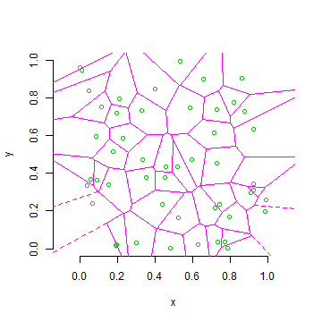

## What is a Voronoi Diagram?

Suppose you are given a set of points on a plane. For example, the points may represent all of the hospitals in a given region. A voronoi diagram is made by finding the regions in the plane closest to each point. In our example, the voronoi diagram represents the area closest to a given hospital.

This sort of diagram is useful for elucidating spatial relationships of various phenomena.  For instance, in 1854, John Snow famously used the locations of cholera cases and local water pumps to trace the cholera outbreak to a single contaminated pump. By overlaying voronoi diagrams about water pumps over Snow's original data, we can elucidate the spatial relationship by visual inspection.

For a visualization of the Snow data with voronoi diagrams, see [this link](http://qgissextante.blogspot.com/2012/10/analyzing-john-snows-cholera-dataset.html)


--- .class #id 

## Voronoi Diagrams in R

Voronoi diagrams can be generated using the `alphanull` class.  In the app, the user determines how many random points are generated as input for the voronoi diagram program. Below is some code to show how it works under the hood:


```r
library(alphahull)
#Generate random matrix with 50 x-y coordinates in the unit square
x <- matrix(runif(50*2), nc = 2)
# Voronoi diagram calculation
delvor.obj <- delvor(x)
```

---

## Example Voronoi Diagram

Here is an example plot of the voronoi diagram:


```r
plot(delvor.obj, asp = 1,
         col = c(3,0,6,0),# colors the voronoi cell boundaries magenta and the points green
         xlim = c(0,1), ylim = c(0,1), xaxt = "n", yaxt = "n", xlab = "x", ylab = "y")
```

 

---

## Further Information

For more information on voronoi diagrams, check the following links:
* the Wikipedia article on [voronoi diagrams](http://en.wikipedia.org/wiki/Voronoi_diagram)
* the documentation (pdf) for the R package [alphahull](http://cran.r-project.org/web/packages/alphahull/alphahull.pdf)
* the documentation (pdf) for the more advanced R package [geometry](http://cran.r-project.org/web/packages/geometry/geometry.pdf)
